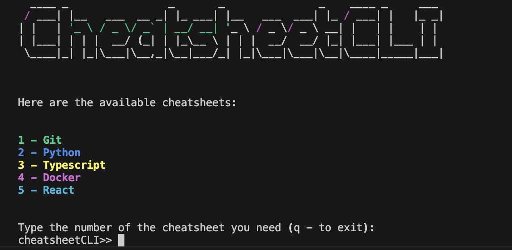

# CheatsheetCLI

**CheatsheetCLI** is a customizable command-line tool designed to display programming cheatsheets in a visually engaging, easy-to-read format. It's a simple tool to quickly access reference information directly from the terminal.

## Features

- **Display Programming Cheatsheets**: Quickly display commonly used commands or references for various technologies.
- **Customizable**: Easily add, update, or modify cheatsheets for your personal use.
- **Simple CLI Interface**: Lightweight and easy-to-use through a few simple commands.


## Prerequisites

- Python 3.x
- Required Python libraries: pyfiglet, rich

## Usage
```bash
$ python cheatsheetcli.py
```
## Output


